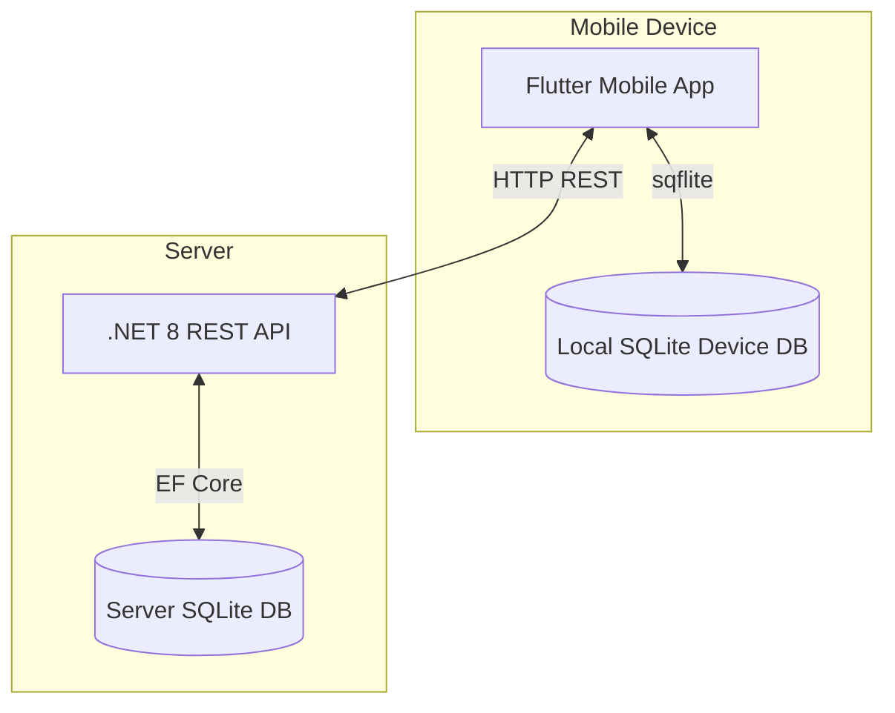

# Waste Glass Recycling System

## 1. Project Overview
The Waste Glass Recycling System is an end-to-end solution designed to streamline the collection of recyclable glass from various suppliers (e.g., restaurants and bars). It features a Flutter mobile application for drivers to view their daily optimized routes, scan supplier barcodes to verify stops, record collected glass weights (clear vs. coloured), and work entirely offline. The backend is a .NET 8 REST API that manages suppliers, calculates routes, and securely synchronizes data from the mobile clients into a centralized database.

---

## 2. Architecture Diagram



**Why SQLite over Firebase/Supabase?**
For this scope, SQLite was explicitly chosen for both the device's offline store and the backend database. 
1. **Zero Configuration:** It allows anyone (like a reviewer or marker) to clone the repository and run the entire stack immediately without needing to set up cloud accounts, configure environment keys, or run Docker containers.
2. **Offline-First:** The Flutter app relies heavily on `sqflite` to queue data when internet connectivity drops, ensuring drivers can complete their routes seamlessly.
3. **Scope Alignment:** Since the brief focuses on a single collector/single trip per day assumption, the massive concurrency features of Firebase or Supabase are unnecessary overhead.

---

## 3. How to Run the Backend

### Prerequisites
- [.NET 8 SDK](https://dotnet.microsoft.com/en-us/download/dotnet/8.0)

### Steps
1. Open a terminal and navigate to the `GlassCollectorApi` folder.
2. Restore dependencies:
   ```bash
   dotnet restore
   ```
3. Apply Entity Framework migrations to create the database:
   ```bash
   dotnet ef database update
   ```
4. Start the API:
   ```bash
   dotnet run
   ```
5. **Confirm it's working:** Open your browser and navigate to `http://localhost:5000/swagger` to view the interactive API documentation.

---

## 4. How to Run the Flutter App

### Prerequisites
- [Flutter SDK](https://docs.flutter.dev/get-started/install)
- Android Emulator or a physical Android/iOS device.

### Steps
1. Open a terminal and navigate to the `glass_collector_app` folder.
2. Install dependencies:
   ```bash
   flutter pub get
   ```
3. Run the app:
   ```bash
   flutter run
   ```

**Important Base URL Note:**
The app is pre-configured to communicate with the local .NET backend. 
- If you are using an **Android Emulator**, the app uses `http://10.0.2.2:5000` (which safely tunnels to your PC's `localhost`).
- If you are testing on a **Physical Device** on the same Wi-Fi, you must open `lib/services/api_service.dart` and change `apiBaseUrl` to your PC's LAN IP address (e.g., `http://192.168.1.42:5000`).

---

## 5. How to Seed / Reset Test Data

The backend automatically seeds a fresh database if it detects no suppliers on startup. To reset the database for a fresh demo:

1. Stop the backend server if it is running (Ctrl+C).
2. Delete the `glasscollector.db` file located in the `GlassCollectorApi` folder.
3. Re-run migrations and start the server:
   ```bash
   dotnet ef database update
   dotnet run
   ```
This will recreate the database, inject 6 predefined suppliers, and generate an "InProgress" trip for today.

---

## 6. Seeded Supplier Barcodes

When testing the app, you will be prompted to scan barcodes. You must generate **Code 128** barcodes using a free online generator (e.g., [barcode.tec-it.com](https://barcode.tec-it.com/en/Code128)) for the following seeded supplier codes:

- `SUP-001` (Green Bottle Restaurant)
- `SUP-002` (Lakeside Hotel)
- `SUP-003` (Spice Garden Cafe)
- `SUP-004` (Ocean View Bar)
- `SUP-005` (Temple Trees Bistro)
- `SUP-006` (Harbour Lights Restaurant)

---

## 7. API Endpoint Reference

| Method | Path | Purpose | Example Request Body | Example Response |
|--------|------|---------|----------------------|------------------|
| **GET** | `/api/trips/today` | Fetches the current daily trip, including calculated route sequence and expected amounts. | *None* | `200 OK`: JSON object with `tripId`, `totalDistanceKm`, and an array of `stops`. |
| **POST** | `/api/collections` | Submits a single collection record and advances the live trip state. | `{"tripId": 1, "supplierCode": "SUP-001", "clearKg": 45.0, "colouredKg": 20.0, "condition": "Good"}` | `200 OK`: JSON containing `updatedStop`, `nextStop`, and `tripCompleted` flag. |
| **GET** | `/api/trips/{tripId}/report` | Generates a summarized report of total amounts vs. expected amounts for all stops. | *None* | `200 OK`: JSON object with `totalClearKg`, `totalColouredKg`, and an array of `suppliers` showing shortfalls. |
| **POST**| `/api/trips/{tripId}/sync` | Bulk syncs offline records sequentially. Handled idempotently to protect against double submissions. | `{"tripId": 1, "records": [ { "supplierCode": "SUP-003", "clearKg": ... } ]}` | `200 OK`: JSON containing sync status for each submitted record. |

---

## 8. Known Limitations & Out of Scope Items

Based strictly on the provided brief, the following constraints are intentionally implemented:
- **No Authentication:** The app and API currently operate openly without JWTs, logins, or role-based access.
- **Single Collector Assumption:** The system assumes a single driver handles a single globally-tracked "trip" per day.
- **Strict Barcode Enforcement:** There is no manual override button if a barcode cannot be read or is damaged; the physical barcode *must* be successfully scanned to unlock the data entry form.
- **Route Re-optimization:** The route is optimized exactly once via TSP logic upon trip creation. It does not dynamically recalculate if the driver goes off-script.
